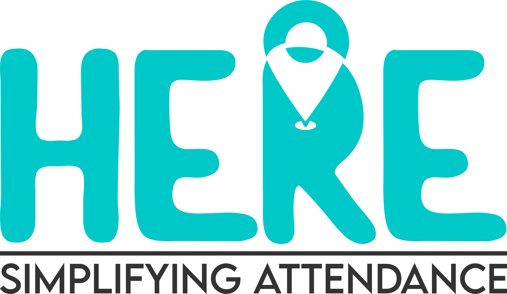

# Here Platform - Logo

## Table of Contents

1. [Introduction](#introduction)
2. [Symbol](#symbol)
3. [Typeface](#typeface)
4. [Colour Palette](#colour-palette)
5. [Consistency with MEST Brand](#consistency-with-mest-brand)

---

## Introduction

The branding scheme for our application was strategically selected to enhance the user experience while accurately representing the purpose of the application.

---

## Symbol

|||
| --------------------------------------------------------- | -------------------------------------- |
| The symbol - the GPS pin - represents the core function of the app, which is recording and tracking the accurate location of its users. This feature simplifies attendance, as our tagline suggests. |          |

---

## Typeface

The typeface selected for our branding is a readable and versatile option. Our chosen font is a simple and minimalistic design that conveys professionalism yet approachability.

---

## Colour Palette

Our colour palette ranges from a vibrant teal to an energetic orange, complemented by a neutral white. This blend of colors adds creativity without being overwhelming to the user.

---

## Consistency with MEST Brand

The app's design also takes into consideration a pressing issue faced by MEST, emphasizing the need for a level of consistency with the MEST brand.

We believe that this thoughtfully crafted branding scheme not only enhances the user experience but also aligns with the core values and goals of our application.

|MEST|HERE|
| --------------------------------------------------------- | -------------------------------------- |
|         |          |

---
