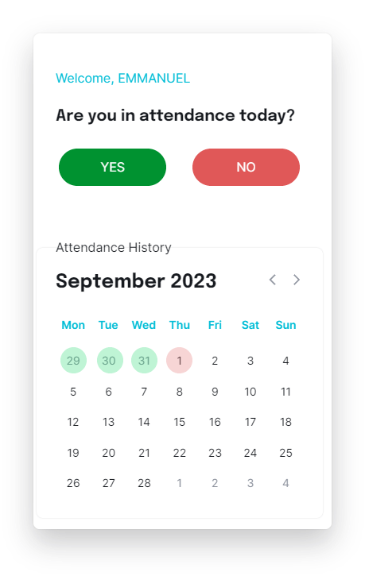
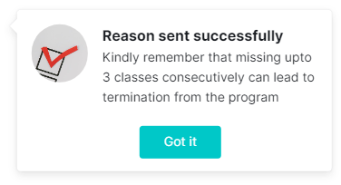

# Here - Application Structure

Welcome to the documentation for the "Here" application's structure.
This provides an overview of the organization and layout of the application codebase.
Understanding the application structure is essential for developers, contributors, and maintainers to navigate and work effectively on the project.

## Table of Contents

1. [Introduction](#introduction)
2. [Project Structure](#project-structure)
3. [Mobile App View](#mobile-app-view)
   - Here
   - Not Here
4. [Web App View](#web-app-view)
9. [License](#license)

## Introduction

The "Here" application will help you keep track of the EIT's attendance and keep everybody informed.

## Project Structure

The "Here" application follows a structured directory layout to keep the code organized and maintainable. Below is an overview of the project structure:

# "Here" Application Structure Overview

### Mobile App View

| Authentification          | Verification            |
| ------------------------- | ------------------------ |
|  |  |

| Confirm Attendance        | Get Notify               |
| ------------------------- | ------------------------ |
|  |  |

| Tell us why               | Get Notify               |
| ------------------------- | ------------------------ |
|  |  |

### Web App View

|Sign In|
|-----|
||

|Email Verification|
|-----|
||

|Confirm Attendance|
|-----|
||

|Get Notify|
|-----|
||

|Calendar View|
|-----|
||

|Tell Us Why|
|-----|
||

|Get Notify|
|-----|
||
## License

This project is licensed under the Mest@HERE License - see the [mest/here](LICENSE) file for details.
