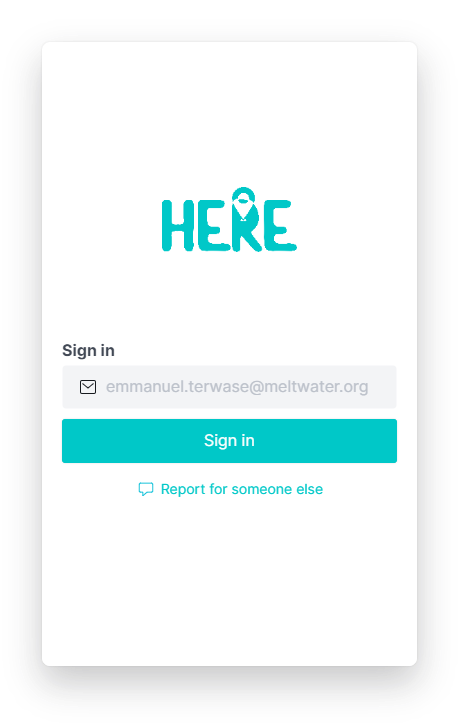

# Here Platform - Sign-In

This is your first door to HERE

## Table of Contents

1. [Introduction](#introduction)
2. [Features](#features)
3. [Steps](#steps)

## Introduction

The Sign-In Page is a crucial component of the "Here" platform, providing a secure and user-friendly way for users, including Entrepreneurs in Training (EITs), to access their accounts. This page allows users to sign in using email and OTP code.

## Features

The Sign-In Page of the "Here" platform includes the following features:

- User authentication with email and password.
- Secure password hashing and validation.
- Error handling for incorrect credentials.
- "Forgot Password" functionality for password reset.
- Integration with the user management system of the "Here" platform.
- Responsive design for various devices.

## Steps

| Authentification          | Verification            |
| ------------------------- | ------------------------ |
|  |  |
